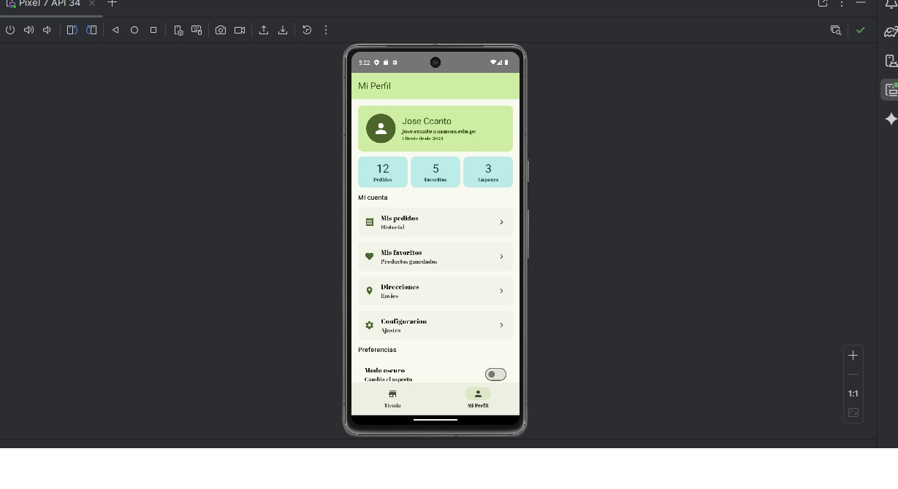

# SanMarcosStore

Aplicación Android desarrollada con **Jetpack Compose** y **Material Design 3**.
El proyecto implementa navegación entre pantallas, componentes reutilizables, búsqueda dinámica de productos y personalización visual mediante Material Theme Builder.

---

## Características

- Jetpack Compose
- Material Design 3
- Navegación con Navigation Compose
- Arquitectura modular
- Lista dinámica de productos
- Buscador en tiempo real
- Floating Action Button (FAB)
- Formularios con botones Material 3
- Pantalla de perfil interactiva
- Tema personalizado con Material Theme Builder

---

## Tecnologías utilizadas

- Kotlin
- Jetpack Compose
- Material Design 3
- Navigation Compose
- Android Studio Hedgehog+
- Gradle Kotlin DSL

---

## Estructura del proyecto

```plaintext
com.labo03.sanmarcosstore/
│
├── MainActivity.kt
├── model/
│   └── Producto.kt
│
├── ui/
│   ├── components/
│   │   └── ProductoItem.kt
│   │
│   ├── screens/
│   │   ├── TiendaScreen.kt
│   │   └── PerfilScreen.kt
│   │
│   ├── navigation/
│   │   └── AppNavigation.kt
│   │
│   └── theme/
│       ├── Color.kt
│       ├── Theme.kt
│       └── Type.kt
├── images/
    ├── Mi_Perfil.jpg
    ├── Tienda_formulario.jpg
    └── Tienda_productos.jpg



![Formulario de Tienda] (https://github.com/joseccanto/SanMarcosStoreLab03/blob/main/app/src/main/java/com/labo03/sanmarcosstore/images/Tienda_formulario.jpg)

![Productos de la Tienda] (https://github.com/joseccanto/SanMarcosStoreLab03/blob/main/app/src/main/java/com/labo03/sanmarcosstore/images/Tienda_productos.jpg)


